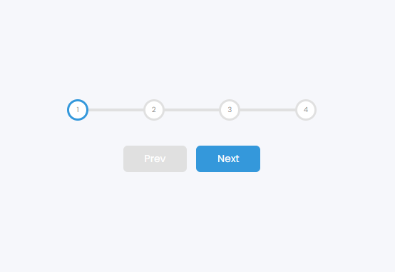

# Progress Steps Clone Project

## 1. Project Description

Build a clone of a Progress Step using HTML, CSS and Javascript

## 2. Tech Stack
1. HTML
2. CSS
3. JavaScript

## 3. Installing
1. Clone the repo
```
https://github.com/VoDuyThienVinh/ProgressSteps
```
2. Open Project Folder
3. Explore
4. Open index.html in Visual Studio Code, using Live Server
5. Click a button next and button preve
6. Enjoy :)

## 4. Screenshots


## 5. Link github-page
```
https://voduythienvinh.github.io/ProgressSteps/
```

## Adatep From:
Udemy Course: 50 Project in 50 Days - HTML, CSS & Javascript
Project Name: Day 2 - Progress Steps
Create by: Brad Traversy, Florin Pop
Last updated 12/2020
URL: https://www.udemy.com/course/50-projects-50-days/
